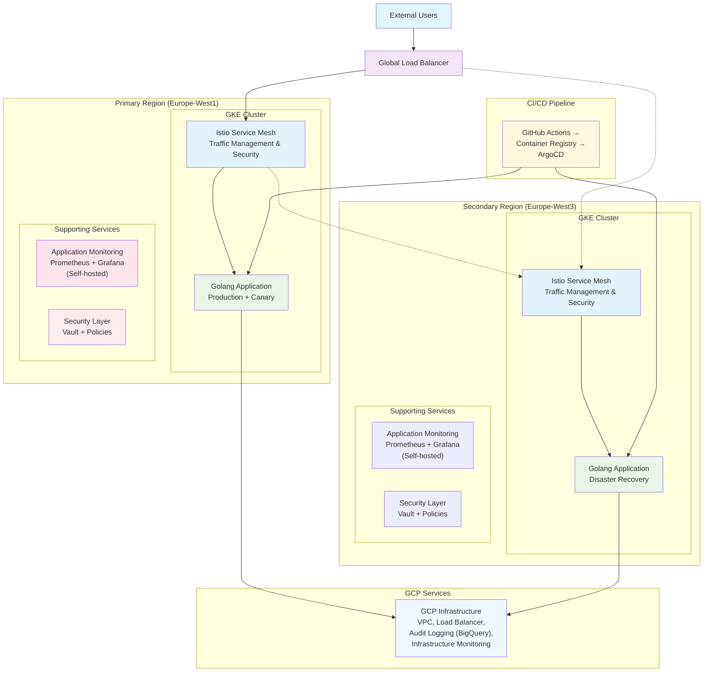

# Golang HA Infrastructure - Architecture Diagram

## High-Level Multi-Region GKE Architecture

## Architecture Components

### Primary Region
- **Cluster Name**: golang-ha-primary
- **Node Pools**: 2 pools (5 total nodes)
- **Network**: Private subnet with Cloud NAT
- **Purpose**: Primary production traffic

### Secondary Region  
- **Cluster Name**: golang-ha-secondary
- **Node Pools**: 2 pools (3 total nodes)
- **Network**: Private subnet with Cloud NAT  
- **Purpose**: Failover and disaster recovery

### Service Mesh (Istio)
- **Traffic Management**: 80/20 canary split, header-based routing
- **Security**: mTLS between services, authentication, authorization
- **Observability**: Distributed tracing, metrics, logging
- **Resilience**: Circuit breakers, retries, fault injection
- **Cross-Region**: Multi-cluster service discovery and failover

### Application Monitoring Stack
- **Prometheus**: Self-hosted metrics collection from applications
- **Grafana**: Self-hosted dashboards for visualization
- **AlertManager**: Self-hosted notification routing
- **Custom Metrics**: Application-specific monitoring (HTTP requests, response times)
- **Infrastructure Monitoring**: GCP Cloud Monitoring for infrastructure alerts

### Security Layer
- **HashiCorp Vault**: Secret management and rotation
- **Pod Security Standards**: Container security policies
- **Network Policies**: Micro-segmentation
- **Istio Security**: Service-to-service encryption

### CI/CD Pipeline
- **GitHub Actions**: Automated build and deployment
- **Container Registry**: Secure image storage
- **ArgoCD**: GitOps-based deployment
- **Canary Strategy**: Progressive deployment with rollback

## Traffic Flow

1. **User Request** → Istio Gateway (Load Balancer)
2. **TLS Termination** → HTTPS/HTTP traffic handling
3. **VirtualService** → 80% to stable, 20% to canary
4. **Service Discovery** → Route to healthy pods
5. **Application** → Process request and return response
6. **Monitoring** → Metrics collected by Prometheus
7. **Logging** → Centralized logging to Cloud Logging

## Failover Mechanism

1. **Health Checks** → Continuous monitoring of primary region
2. **Failure Detection** → Automated detection of unhealthy services
3. **Traffic Switching** → Istio routes traffic to secondary region
4. **Service Recovery** → Automatic scaling and recovery procedures
5. **Failback** → Return to primary when healthy

## Scaling Strategy

### Horizontal Pod Autoscaler (HPA)
- **CPU Utilization**: Scale at 70% CPU usage
- **Memory Utilization**: Scale at 80% memory usage
- **Custom Metrics**: Scale based on HTTP requests per second
- **Min Replicas**: 2 (high availability)
- **Max Replicas**: 10 (cost control)

### Cluster Autoscaler
- **Node Scaling**: Automatic addition/removal of nodes
- **Spot Instances**: Cost optimization for non-critical workloads
- **Multi-zone**: Distribution across availability zones

## Security Architecture

### Network Security
- **Private GKE**: Nodes in private subnets only
- **Authorized Networks**: Restricted API server access
- **Network Policies**: Pod-to-pod traffic control
- **Cloud NAT**: Controlled outbound internet access

### Application Security
- **Pod Security Standards**: Enforced security contexts
- **Service Accounts**: Least privilege access
- **Workload Identity**: Secure GCP service access
- **Container Scanning**: Vulnerability assessment

### Data Security
- **Encryption at Rest**: All persistent data encrypted
- **Encryption in Transit**: TLS for all communications
- **Secret Management**: HashiCorp Vault integration
- **Key Management**: HashiCorp Vault for secret management

## Disaster Recovery

### Recovery Time Objective (RTO): 30 minutes
1. **Detection**: 5 minutes (automated monitoring)
2. **Decision**: 5 minutes (runbook execution)
3. **Execution**: 15 minutes (traffic redirection)
4. **Verification**: 5 minutes (health validation)

### Recovery Point Objective (RPO): 15 minutes
- **Continuous Replication**: Application state sync
- **Database Backups**: 15-minute incremental backups
- **Configuration Sync**: GitOps ensures consistency

## Cost Optimization

### Resource Efficiency
- **Right-sizing**: Pods sized based on actual usage
- **Spot Instances**: Up to 80% cost savings for suitable workloads
- **Auto-scaling**: Scale to zero during low traffic periods
- **Reserved Instances**: Long-term capacity planning

### Monitoring Costs
- **Budget Alerts**: Proactive cost monitoring
- **Resource Quotas**: Prevent resource abuse
- **Cost Attribution**: Per-team/project cost tracking
- **Optimization Recommendations**: Automated suggestions

## Maintenance and Updates

### Rolling Updates
- **Zero Downtime**: No service interruption
- **Gradual Rollout**: Progressive deployment strategy
- **Automated Rollback**: Failure detection and recovery
- **Health Checks**: Continuous validation during updates

### Infrastructure Updates
- **Terraform Plans**: Infrastructure change preview
- **Staged Deployment**: Test in secondary before primary
- **Backup Strategy**: State and configuration backups
- **Validation Testing**: Automated infrastructure testing